# 安装 go 语言开发环境实验报告

## 一、安装VScode

我是直接在ubuntu软件里搜索VSCode的，直接安装就行了

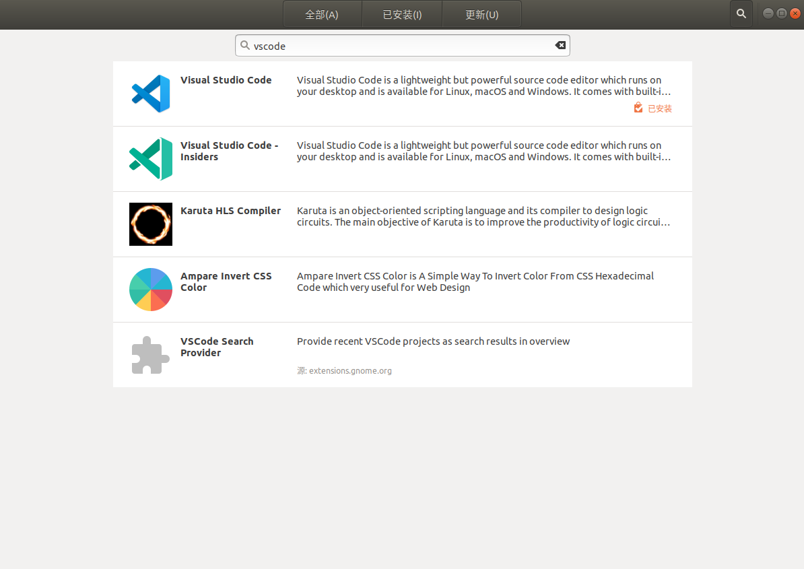

安装好后如图所示

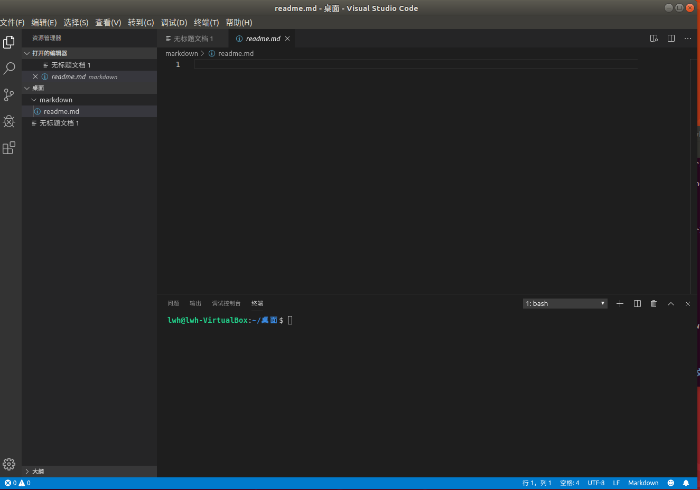

## 二、安装 golang

在go的官网里选择对应的版本，先下载

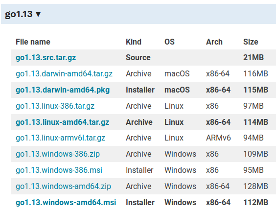

然后将下载的压缩包，并提取到 /usr/local 目录，在 /usr/local/go 中创建Go目录树。
tar -C /usr/local -xzf go$VERSION.$OS-$ARCH.tar.gz
并将此行添加到你的 /etc/profile（全系统安装）或 $HOME/.profile 文件中

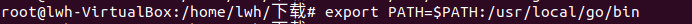

## 三、安装和配置

首先创建工作空间
mkdir $HOME/gowork
配置环境变量，在 ~/.profile 文件中添加:

export GOPATH=$HOME/gowork

export PATH=$PATH:$GOPATH/bin

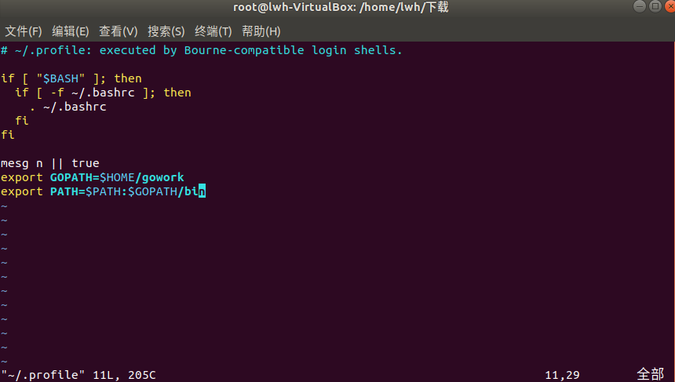

然后
source $HOME/.profile

检查配置，可以看到

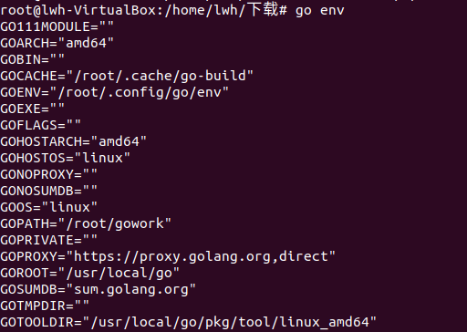

然后在vocode中，编译运行，可以看到运行结果

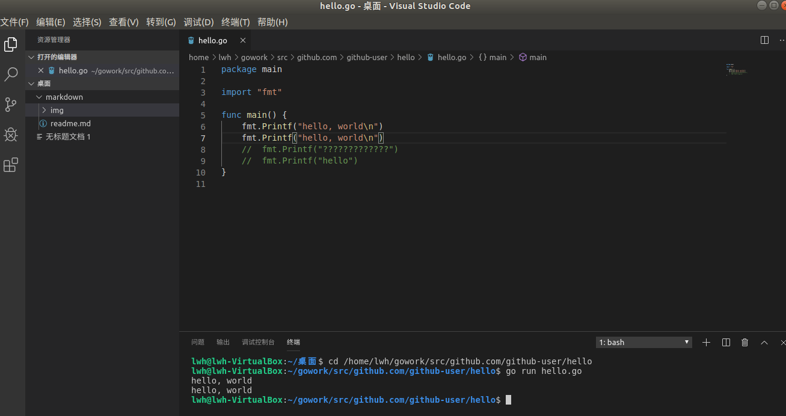

## 四、安装必要的工具和插件

工具和插件方面，科学上网就可以了

## 五、安装与运行 go tour

科学上网的话，我go get连接的是谷歌的网页

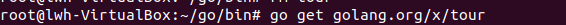

不过连不上。。。

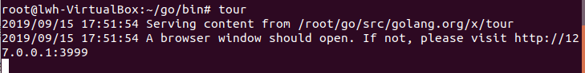

## 六、完成第一个包的创建

1.环境变量已经在前面配好，这里不再描述.

2.包路径

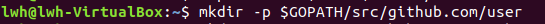

3.第一个程序

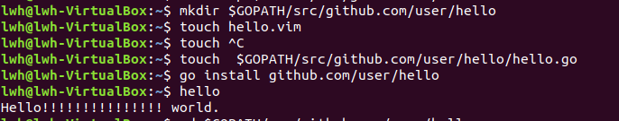

4.第一个库

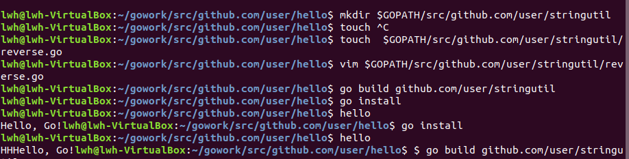

5.文件结构

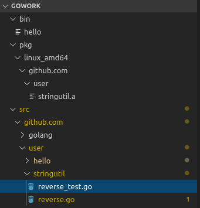

6.测试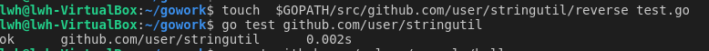

7.远程包

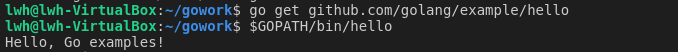

# 实验就完成了！