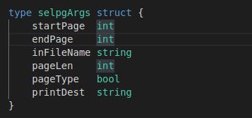

# CLI 命令行实用程序开发基础

## 一、概述

CLI（Command Line Interface）实用程序是Linux下应用开发的基础。正确的编写命令行程序让应用与操作系统融为一体，通过shell或script使得应用获得最大的灵活性与开发效率。Linux提供了cat、ls、copy等命令与操作系统交互；go语言提供一组实用程序完成从编码、编译、库管理、产品发布全过程支持；容器服务如docker、k8s提供了大量实用程序支撑云服务的开发、部署、监控、访问等管理任务；git、npm等都是大家比较熟悉的工具。尽管操作系统与应用系统服务可视化、图形化，但在开发领域，CLI在编程、调试、运维、管理中提供了图形化程序不可替代的灵活性与效率。

## 二、实验内容

使用 golang 开发 [开发 Linux 命令行实用程序](https://www.ibm.com/developerworks/cn/linux/shell/clutil/index.html) 中的 **selpg**

## 三、设计说明

首先，定义数据结构，下面是selpg用到的数据结构

这些数据分别记录着一次process的参数，如开始页，结束页，文件名，分页类型等.

接下来selpg的实现主要有以几步
**1.得到参数**
**2.分析参数（检查参数、报错等）**
**3.根据参数调用指令来实现目的**

下面是各个步骤的实现
1.得到参数

2.分析参数（检查参数、报错等）

在这一部分，程序会分析得到的输入是否合法，比如检查输入的指令是否是在指令集中，以及输入的数字（如页数）是否为合法数字，如果任一部分不合法，则报错提示，并退出程序

3.3.根据参数调用指令来实现目的

这一部分是实际上process的过程，在这一部分，会检测文件的存在和可读性，以及文件内容的大小，当前面的任一条件无法满足输入的需求时，页同样会报错，并退出程序，若都满足条件，则打开输入流（可能是文件也可能是其他）并根据需求读对应的页，病把它输出到指定输出。

## 四、使用与测试结果

我新建了一个1000行的文本data，在这个文本中，每一行有一个等于行数的数字，并且，我每隔20行，就打一个\f换页符，此外，我设置的默认的每页行数是30.

1../cli -s2 -e2 data       可以看出，第二页的开始是30，结束于60

2../cli -s1 -e2 -l7 data             当设置每页为7行时，第一页到第二页共14行

3../cli -s3 -e3 -f data      当加入-f参数时，由于前面每20行加一个\f，因此会有20行打印出来

# 实验就完成了！
